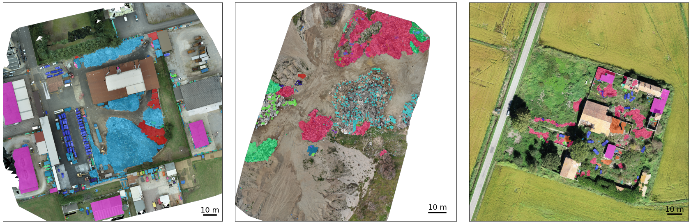

# DroneWaste

<!-- **TODO: ADD PAPER TITLE** -->

*Luca Morandini, Andrea Diecidue, Thanos Petsanis, Enrico Targhini, Georgios Karatzinis, Giacomo Boracchi, Athanasios Ch. Kapoutsis, Piero Fraternali, Elias B. Kosmatopoulos*



## DroneWaste dataset

The DroneWaste dataset is a public collection of aerial images for developing waste recognition models.
Each visible waste instance is annotated with a segmentation mask, a bounding box, and a waste category.
The dataset contains 4993 images, 5135 annotations, and 20 waste materials. Each category is mapped to a [European Waste Code](https://ec.europa.eu/eurostat/web/waste/methodology) (EWC) to uniquely identify the waste type.

The dataset is available for download on the [DroneWaste Zenodo repository](https://zenodo.org/).

## Waste detection models

<!-- This repo contains the training and evaluation scripts of the waste detection models presented in the paper: *TODO: ADD PAPER TITLE*. -->

The three object detectors explored in the paper are: YOLOv8, YOLOv12 and Faster-RCNN.
The table summarizes performance on the DroneWaste dataset.

| Model | Parameters | mAP@50 | Documentation |
| --- | --- | --- | --- |
| YOLOv8x | 68.2M | 38.2% | [Ultralytics](https://docs.ultralytics.com/models/yolov8) |
| YOLOv12x (turbo) | 59.3M | 38.5% | [YOLOv12 repo](https://github.com/sunsmarterjie/yolov12) |
| Faster-RCNN | 41.4M | 36.5% | [MMDetection repo](https://github.com/open-mmlab/mmdetection/tree/main/configs/faster_rcnn) |

## Setup

Follow the [setup instructions](docs/setup.md) to create the virtual environments and install the dependencies.

## Usage

Model training and evaluation on the DroneWaste dataset is performed using a k-fold cross-validation approach. Therefore, one model is trained for each fold and the overall performance is evaluated by combining the results from all folds.

### Training

Follow the [training instructions](docs/train.md) to train a model on the DroneWaste dataset.

### Evaluation

Follow the [evaluation instructions](docs/eval.md) to evaluate a model on the DroneWaste dataset.

<!-- ## Citation

```bibtex
@article{morandini2025dronewaste,
    title={TODO: ADD PAPER TITLE},
    author={Morandini, Luca and
            Diecidue, Andrea and
            Petsanis, Thanos and
            Targhini, Enrico and
            Karatzinis, Georgios and
            Boracchi, Giacomo and
            Fraternali, Piero and
            Kosmatopoulos, Elias B. and
            Kapoutsis, Athanasios Ch.},
    journal={TODO: ADD JOURNAL},
    year={2025}
}
``` -->
